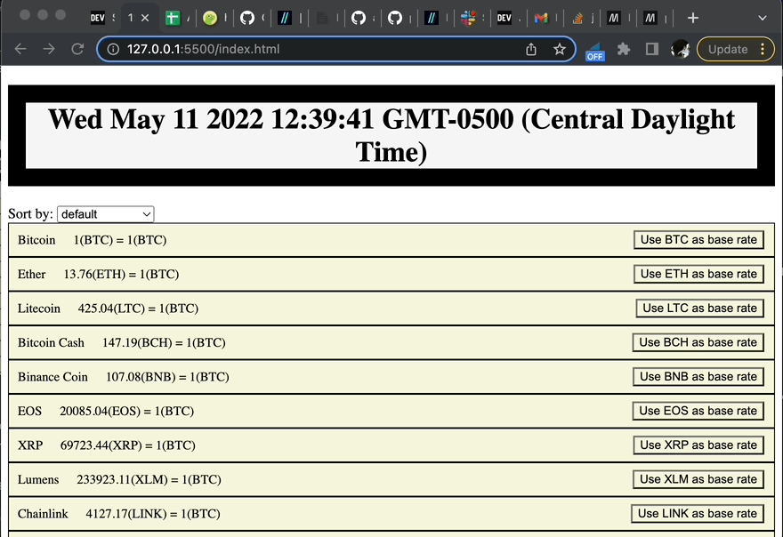
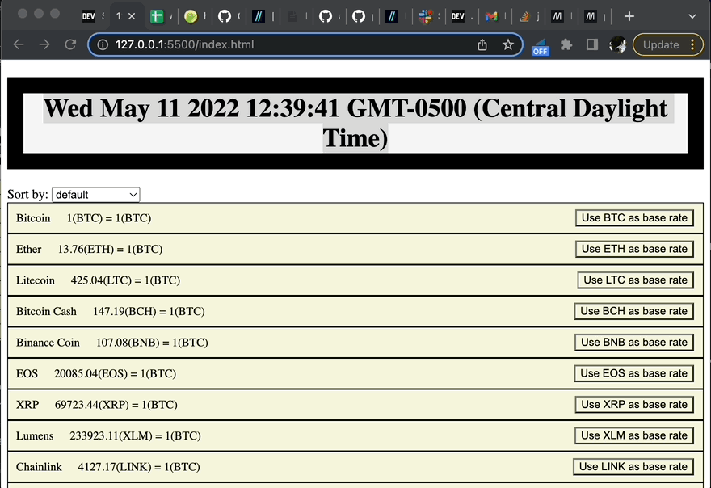
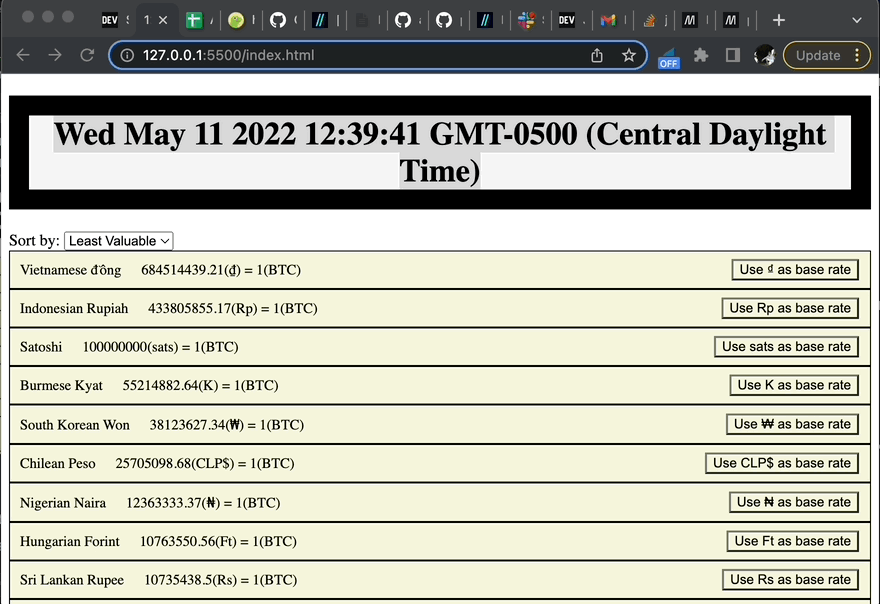
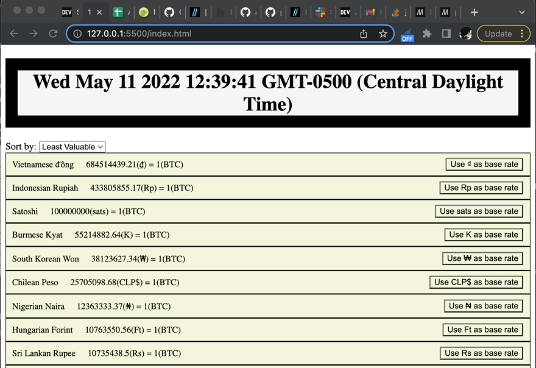

# phase-1-javascript-project-mode-JPStupfel

## Description

phase-1-javascript-project-mode-JPStupfel is a single-page, in-browser, web-based application. It functions as a global currency indicator. It is composed using JavaScript, HTML and CSS.

## Features

### Time Stamp

The bar on the top of the screen indicates the date and time the fetch request for the data was placed. Note, the page's functionality, i.e. "sort alphabetically," or "change base rate" does not refresh the page or send another fetch request. To update the time stamp of the data, the user must refresh the page.



### List Sort

You can sort the list of currencies using the "sort by" drop down menu. For example, to sort the list of currencies alphabetically, click "sort by">"Alphabetically"



### Expand Currency

You can get a bit more information for each currency simply by clicking on the name / value element of an individual currency.



### Change Base Rate

This is by far the most robust feature. By clicking one of the "Use \_\_ as base rate" buttons, the user can change the base rate used as reference for every other currency. For example, if the user clicks "Use US Dollars as Base Rate", the value of Bitcoin will be shown in US Dollars. Conversly, by clicking "Use Bitcoin as Base Rate," The price in Bitcoin will show as "1(btc)" and the value in US Dollars will show the current value of Bitcoin in Dollars.


## Getting Started

To view the program, along with the code in visual studio code, thesimply navigate to the repo in your mac terminal and type:

```shell
open index.html
code .
```

## Public API in use

All fetch requests are being made from "https://api.coingecko.com/api/v3/exchange_rates".

```javascript
fetch("https://api.coingecko.com/api/v3/exchange_rates").then((res) =>
  res.json()
);
```
